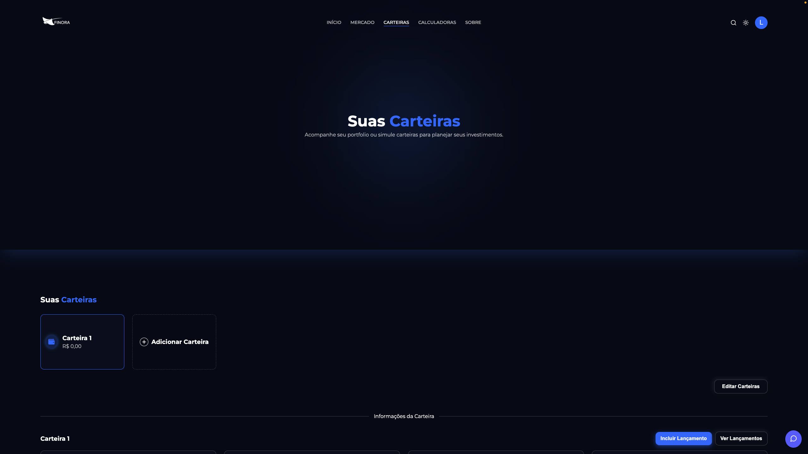
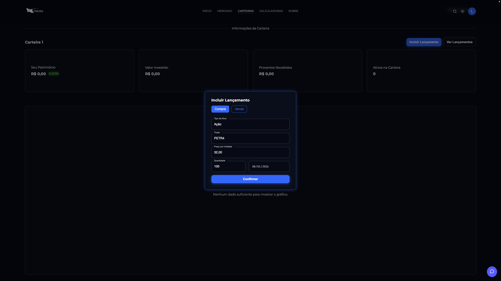
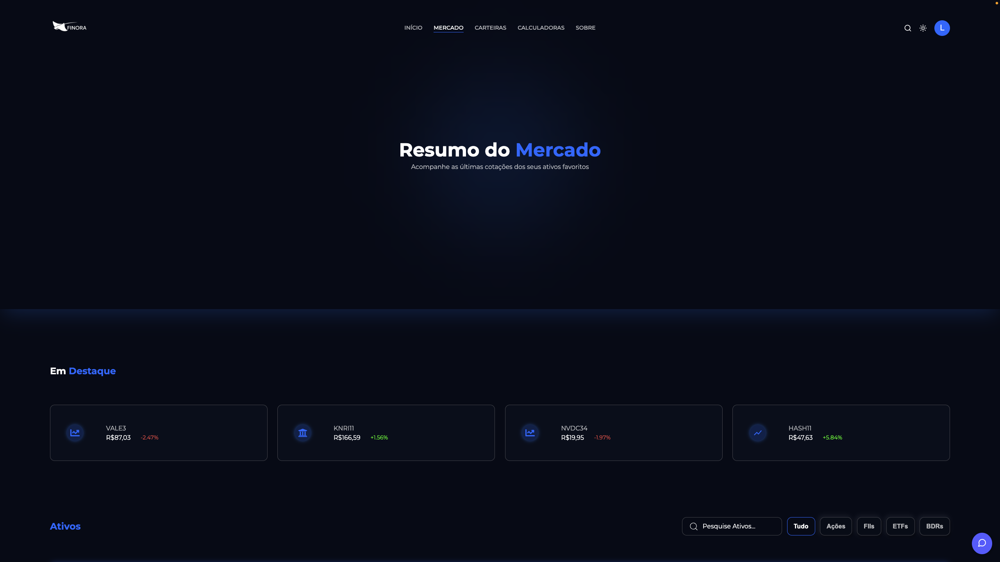
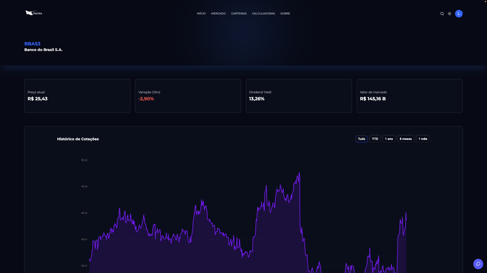
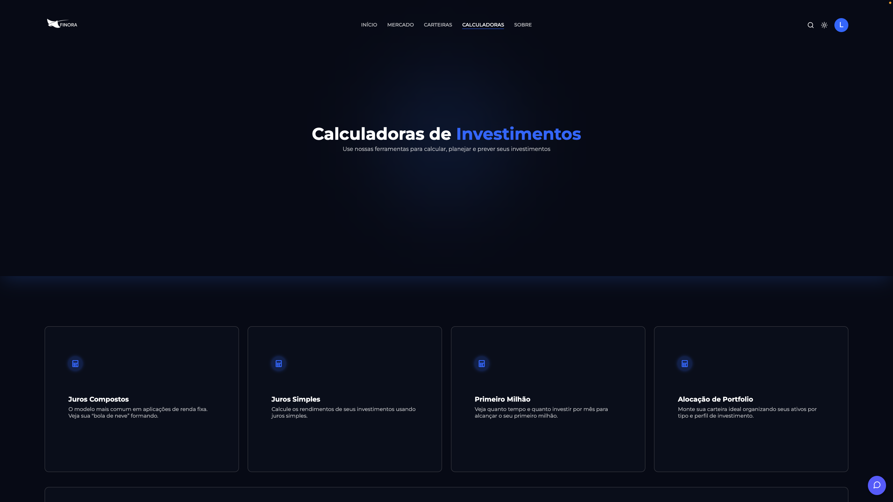
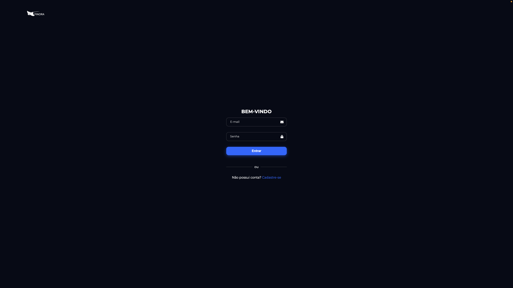

# Finora

**Finora** é uma plataforma centralizada de gestão de investimentos onde os usuários podem gerenciar, simular e acompanhar seus investimentos através de uma interface unificada e intuitiva. A plataforma é voltada para o mercado financeiro brasileiro, com suporte a Ações, Fundos Imobiliários (FIIs), ETFs e Brazilian Depositary Receipts (BDRs).


---

## Sumário

- [Funcionalidades](#funcionalidades)
- [Tecnologias Utilizadas](#tecnologias-utilizadas)
- [Pré-requisitos](#pré-requisitos)
- [Instalação](#instalação)
- [Executando o Projeto](#executando-o-projeto)
- [Estrutura do Projeto](#estrutura-do-projeto)
- [Esquema do Banco de Dados](#esquema-do-banco-de-dados)
- [Endpoints da API](#endpoints-da-api)
- [Capturas de Tela](#capturas-de-tela)

---

## Funcionalidades

### Gestão de Carteiras
Crie múltiplas carteiras de investimento, adicione ativos com rastreamento de preço e data de compra, registre operações de compra e venda, e acompanhe o desempenho ao longo do tempo. A plataforma calcula automaticamente o saldo de cada ativo, impede vendas que resultem em quantidade negativa e exibe a evolução do patrimônio com gráficos interativos.





### Acompanhamento de Mercado
Página dedicada para navegar por mais de 110 ativos do mercado brasileiro (B3) e mercados internacionais via BDRs. Os ativos podem ser filtrados por tipo (Ações, FIIs, ETFs, BDRs) e a página destaca os ativos com maior volatilidade em cada categoria. Visualize preços atuais, variação nas últimas 24h, capitalização de mercado, dividend yield e volume negociado.



### Análise Individual de Ativos
Cada ativo possui uma página detalhada com gráfico de preço histórico dos últimos 2 anos, desempenho acumulado no ano (YTD) e indicadores fundamentalistas completos: P/L (trailing e forward), P/VP, valor patrimonial, LPA, ROE, ROA, Beta, PEG Ratio, margem EBITDA, margem bruta, margem operacional e margem líquida.



### Calculadoras Financeiras
Conjunto de ferramentas para planejamento financeiro:
- **Juros Compostos** — Simule o crescimento de investimentos com aportes mensais e taxa de rendimento.
- **Juros Simples** — Calcule rendimentos com taxa fixa sobre o valor inicial.
- **Primeiro Milhão** — Projete em quanto tempo você atingirá R$ 1.000.000 com base em aportes e rentabilidade.
- **Alocação de Ativos** — Calcule a distribuição percentual ideal entre diferentes ativos da carteira.



### Assistente Financeiro com IA
Chatbot integrado com o modelo LLaMA 3 (via Ollama) para tirar dúvidas e receber orientações sobre investimentos. As conversas ficam salvas no banco de dados, permitindo que o usuário retome o histórico a qualquer momento. As respostas são renderizadas em Markdown para melhor legibilidade.

### Sistema de Autenticação
Cadastro e login seguros com tokens JWT (expiração de 1 hora) e hash de senhas com bcrypt. O usuário pode atualizar sua senha e fazer upload de foto de perfil. Rotas protegidas garantem que apenas usuários autenticados acessem funcionalidades como carteiras e chatbot.



### Tema Claro e Escuro
Alterne entre modo claro e escuro com um clique na barra de navegação. A preferência do usuário é salva e aplicada automaticamente nas próximas visitas.


### Busca Global de Ativos
A barra de navegação inclui um campo de busca com autocomplete que permite encontrar rapidamente qualquer ativo pelo ticker ou nome completo. Os resultados são agrupados por tipo (Ação, FII, ETF, BDR) e direcionam o usuário diretamente para a página de análise do ativo.

### Design Responsivo
Interface totalmente adaptada para dispositivos móveis e desktops, utilizando componentes Material-UI. A navegação em telas menores é feita através de um menu lateral (drawer) com transições suaves.

---

## Tecnologias Utilizadas

| Camada          | Tecnologia                                           |
|-----------------|------------------------------------------------------|
| Frontend        | React 19, React Router 7, Material-UI 7, Chart.js 4 |
| Backend         | Node.js, Express 5                                   |
| Banco de Dados  | MySQL                                                |
| Autenticação    | JWT, bcrypt                                          |
| Pipeline de Dados | Python 3, yfinance, pandas                         |
| Assistente IA   | Ollama + LLaMA 3                                     |

---

## Pré-requisitos

Antes de instalar, certifique-se de ter os seguintes itens instalados na sua máquina:

- **Node.js** (v16 ou superior) e **npm**
- **MySQL** (v8 recomendado)
- **Python 3** com os seguintes pacotes:
  - `yfinance`
  - `pandas`
  - `mysql-connector-python`
- **Ollama** (opcional, necessário apenas para o chatbot de IA) com o modelo `llama3` baixado

---

## Instalação

### 1. Clone o repositório

```bash
git clone https://github.com/DuduPNetto/finora_react.git
cd finora_react
```

### 2. Configure o banco de dados

Certifique-se de que o servidor MySQL está rodando e execute o script de inicialização:

```bash
mysql -u root -p < api/init.sql
```

Isso cria o banco de dados `projeto_react` e todas as tabelas necessárias.

### 3. Configure as credenciais do banco de dados

Por padrão, o projeto está configurado com `user: "root"` e `password: "password"`. Se o seu MySQL utiliza credenciais diferentes, será necessário alterá-las nos seguintes arquivos:

- **`api/db.js`** — conexão do backend com o banco:
  ```js
  const db = mysql.createPool({
    host: "localhost",
    user: "root",           // altere para o seu usuário
    password: "password",   // altere para a sua senha
    database: "projeto_react",
  });
  ```

- **`api/get_assets.py`** — script Python de coleta de dados:
  ```python
  conn = mysql.connector.connect(
      host="localhost", user="root", password="password", database="projeto_react"
  )
  ```

### 4. Configure as variáveis de ambiente

O backend espera um arquivo `.env` no diretório `api/`:

```bash
# api/.env
JWT_SECRET=sua_chave_secreta_aqui
```

### 5. Instale as dependências do backend

```bash
cd api
npm install
```

### 6. Instale as dependências do frontend

```bash
cd ../app
npm install
```

### 7. Popule os dados de mercado

Volte ao diretório `api/` e execute o script Python de coleta de dados:

```bash
cd ../api
python get_assets.py
```

Esse script busca 2 anos de dados históricos de mais de 110 tickers no Yahoo Finance e popula as tabelas `historical_data` e `fundamentals_data`. O processo leva alguns minutos devido ao limite de requisições da API.

### 8. (Opcional) Configure o chatbot de IA

Instale o Ollama a partir de [ollama.com](https://ollama.com) e baixe o modelo LLaMA 3:

```bash
ollama pull llama3
```

Certifique-se de que o Ollama está rodando antes de utilizar o chatbot. Ele se comunica com a API local do Ollama em `http://localhost:11434`.

---

## Executando o Projeto

Você precisa de dois terminais — um para o backend e outro para o frontend.

**Terminal 1 — Backend:**

```bash
cd api
npm start
```

O servidor da API inicia em `http://localhost:3001` com auto-reload via nodemon.

**Terminal 2 — Frontend:**

```bash
cd app
npm start
```

O servidor de desenvolvimento React inicia em `http://localhost:3000` e abre no navegador automaticamente.

---

## Estrutura do Projeto

```
finora_react/
├── api/                        # Backend (Node.js / Express)
│   ├── controllers/            # Handlers de rotas / lógica de negócio
│   │   ├── assets.js           # Consulta de dados de mercado
│   │   ├── emails.js           # Operações de e-mail
│   │   ├── messages.js         # Armazenamento de mensagens do chatbot
│   │   ├── users.js            # Autenticação, cadastro, perfil
│   │   └── wallets.js          # CRUD de carteiras e dados históricos
│   ├── routes/                 # Definições de rotas do Express
│   ├── middleware/
│   │   └── auth.js             # Verificação de token JWT
│   ├── db.js                   # Configuração de conexão MySQL
│   ├── index.js                # Ponto de entrada do servidor Express
│   ├── init.sql                # Inicialização do esquema do banco
│   ├── get_assets.py           # Pipeline de dados do Yahoo Finance
│   └── .env                    # Variáveis de ambiente
│
├── app/                        # Frontend (React)
│   ├── src/
│   │   ├── pages/              # Componentes de página
│   │   │   ├── Home.jsx        # Página inicial
│   │   │   ├── Login.jsx       # Autenticação
│   │   │   ├── Register.jsx    # Cadastro de usuário
│   │   │   ├── Wallets.jsx     # Gestão de carteiras
│   │   │   ├── Market.jsx      # Visão de mercado
│   │   │   ├── TickerDetails.jsx  # Análise individual de ativos
│   │   │   ├── Calculators.jsx # Menu de calculadoras
│   │   │   └── calculators/    # Sub-páginas das calculadoras
│   │   ├── components/         # Componentes reutilizáveis
│   │   │   ├── NavBar.jsx      # Barra de navegação com busca
│   │   │   ├── ChatBot.jsx     # Assistente financeiro com IA
│   │   │   ├── Grafico.jsx     # Componente de gráfico
│   │   │   └── ...
│   │   ├── context/            # Provedores de contexto React
│   │   │   ├── AuthContext.jsx  # Estado de autenticação
│   │   │   └── ThemeContext.jsx # Gerenciamento de tema
│   │   ├── data/
│   │   │   └── assetsData.js   # Hook de dados de ativos e formatação
│   │   ├── api/
│   │   │   └── assetsAPI.js    # Cliente de API do frontend
│   │   └── css/                # Folhas de estilo dos componentes
│   └── public/                 # Arquivos estáticos e imagens
│
├── assets/                     # Capturas de tela do README
└── README.md
```

---

## Esquema do Banco de Dados

A aplicação utiliza 6 tabelas no banco de dados MySQL `projeto_react`:

| Tabela             | Finalidade                                                    |
|--------------------|---------------------------------------------------------------|
| `users`            | Contas de usuário (UUID, nome, e-mail, senha com hash, foto)  |
| `wallets`          | Carteiras de investimento vinculadas a usuários               |
| `wallet_assets`    | Ativos dentro das carteiras (ticker, quantidade, preço/data de compra) |
| `historical_data`  | Dados diários de preço/volume/dividendos por ticker (2 anos)  |
| `fundamentals_data`| Indicadores fundamentalistas por ticker (P/L, ROE, Beta, margens) |
| `messages`         | Histórico de conversas do chatbot por usuário                 |

---

## Endpoints da API

### Públicos

| Método | Rota              | Descrição                          |
|--------|-------------------|------------------------------------|
| GET    | `/assets/`        | Retorna todos os dados de mercado  |
| GET    | `/assets/:ticker` | Retorna dados de um ticker específico |

### Autenticação

| Método | Rota              | Descrição                          |
|--------|-------------------|------------------------------------|
| POST   | `/user/login`     | Autenticar e receber token JWT     |
| POST   | `/user/register`  | Criar uma nova conta               |

### Protegidos (requer JWT)

| Método | Rota                               | Descrição                          |
|--------|------------------------------------|------------------------------------|
| GET    | `/user/info`                       | Obter perfil do usuário            |
| POST   | `/user/verify`                     | Verificar validade do token        |
| POST   | `/user/updatePassword`             | Alterar senha                      |
| POST   | `/user/upload_photo`               | Enviar foto de perfil              |
| GET    | `/wallets/`                        | Listar carteiras do usuário        |
| POST   | `/wallets/`                        | Criar nova carteira                |
| PUT    | `/wallets/:id`                     | Renomear carteira                  |
| DELETE | `/wallets/:id`                     | Excluir carteira                   |
| POST   | `/wallets/:walletId/assets`        | Adicionar ativo à carteira         |
| PUT    | `/wallets/:walletId/assets/:id`    | Editar ativo na carteira           |
| DELETE | `/wallets/:walletId/assets/:id`    | Remover ativo da carteira          |
| GET    | `/wallets/:walletId/historical`    | Obter dados históricos da carteira |
| POST   | `/messages/`                       | Salvar mensagem do chatbot         |
| POST   | `/messages/user`                   | Obter histórico de chat do usuário |

---

