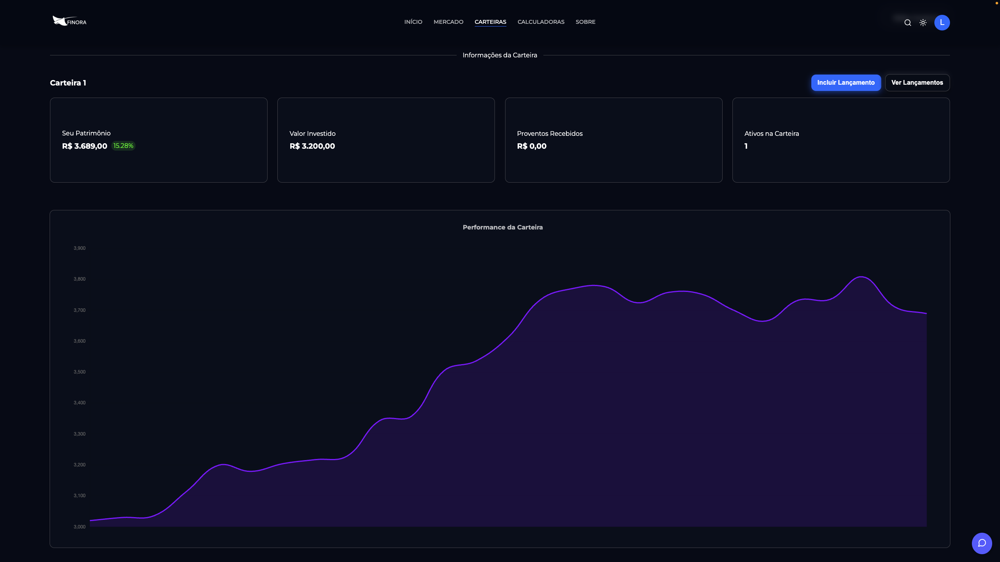

# Finora

A Finora é uma plataforma de investimentos centralizada. Os usuários podem gerenciar, simular e acompanhar seus investimentos de maneira simples.

O website possuí um sistema de cadastro:

Quando o usuário está com o login feito, a landing page inclui alguns itens a mais, como a página de carteiras e o menu de usuário:

O usuário pode, então, adicionar ativos e acompanhar a evolução de seu patrimônio:

